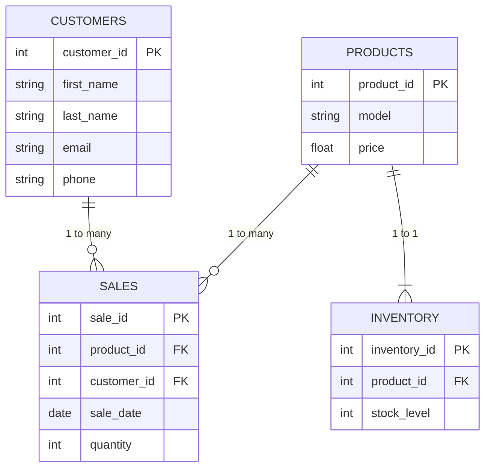

# Documentation
  
  ## 1. * Products
      this entity represents the models of Nike shoes available for sale in the store and provides details about what is being sold.
      
      * Attributes:

       * product_id (PK): Unique identifier for each product.
       * model: Name of the shoe model.
       * price: Retail price of the product.
 ## 2. * Costumers
      This entity holds information about the customers who purchase shoes from the store.this is crucial for targeted marketing, customer service, and building loyalty. The Customers entity allows the store to manage customer relationships effectively.
        
      *Attributes:

        * customer_id (PK): Unique identifier for each customer.
        * first_name: Customer's first name.
        * last_name: Customer's last name.
        * email: Customer's email address for contact and marketing.
        * phone: Customer's phone number for communication.
## 3. * Sales
      This entity captures transaction records linking customers with the products they purchase. Analyzing sales data helps in inventory management, forecasting demand, and identifying popular products. 
        
      *Attributes:
        
       * sale_id (PK): Unique identifier for each sale transaction.
       * product_id (FK): References the Products entity to identify which product was sold.
       * customer_id (FK): References the Customers entity to identify who made the purchase.
       * sale_date: Date when the transaction occurred.
       * quantity: Number of units sold in the transaction.
## 4. * Inventory
      This entity tracks the stock levels of various shoe models available in the store. is essential for managing stock levels and ensuring that popular products are available for customers

      * Attributes: 
       
       * inventory_id (PK): Unique identifier for each inventory record.
       * product_id (FK): References the Products entity to indicate which product's stock is being tracked.
       * stock_level: Current quantity of the product available for sale.
 ## 5. * Relationships

       * Products to Sales (1 to many)
         * Description: One product can be sold in many sales transactions. This relationship allows the store to track how many times a specific product is sold

       * Customers to Sales (1 to many)
         * Description: One customer can make multiple purchases over time. This relationship enables the store to analyze customer purchasing patterns and preferences. 

       * Products to Inventory (1 to 1)
         * Description: Each product has a corresponding inventory record that tracks its stock level. This relationship ensures that inventory levels are directly linked to specific products, facilitating efficient stock management. 